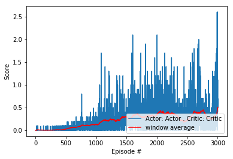

### Overview

The algorithm being used to train the agents is [MADDPG](https://arxiv.org/abs/1706.02275) (Multi-Agent Deep Deterministic Policy Gradient), which is an extension of [DDPG](https://arxiv.org/pdf/1509.02971.pdf) where all agents use the same memory for the critic network to learn from.

The main idea is to combine the best of both value-based methods where we try to derive a value function which outputs the estimated value for each state-action tuple of the agent, and policy-based methods where we try to output the policy directly without calculating value function. Key insight is to use the low variance of value-based estimates i.e Q-learning to neutralize the high variance characteristic of policy-based methods, and also reduce learning time thanks to the directness of policy-based methods where we don't have to calculate values for every states, which is particularly expensive in continuous environments.

In particular, we maintain an Actor network which keeps updating the policy and generates samples to train the Critic, and a Critic network which calculates the Q-value of the current state-action to train the Actor. In practice, we maintain a local and a target network for each Actor / Critic, use the target network to ouput a target value for local network to learn from, and periodically mix local weights into target weights to update the target.

The actor tries to maximize the rewards via gradient ascent, while the critic tries to minimize the difference between estimated state value and the actual state value via gradient descent. Therefore, the actor network's loss function is considered as the minus of the mean of all the critic's estimates, to create a feedback loop between them.

Since multiple agents are involved, we also want to make sure that they can collaborate to reach a common goal. One way of doing this is to use the same memory pool for all agents to learn from. By doing this, we enrich the agents' experience by giving them a chance to learn from each other. This is also the key idea of MADDPG.

We also make use of other techniques such as soft update (slowly updating model weights, 0.1% at a time, to make training more stable therefore avoid high variance when network weights change disruptly) and replay buffer (keep track of a memory buffer to randomly sample from, to avoid learning the same experience again and again), and also adding random noise to make sure the agent can explore sometimes to avoid local minima, which is particularly important at the beginning.

### Training

The actor and critic networks both have 256 units at layer 1 and 128 units at layer 2. This config worked fine in previous project, so I kept using it, and added some batch normalization to stabilize the network, as training might be pretty unstable when many agents are involved.

I also perform a hard update at the beginning to make sure that target network and local network have the same weights before training starts.

The agents (defined in `ddpg_agent.py`) use these hyperparameters as config

- BUFFER_SIZE = int(1e5)  # replay buffer size
- BATCH_SIZE = 1024       # minibatch size
- GAMMA = 0.99            # discount factor
- TAU = 1e-3              # for soft update of target parameters
- LR_ACTOR = 1e-4         # learning rate of the actor 
- LR_CRITIC = 1e-3        # learning rate of the critic
- WEIGHT_DECAY = 0        # L2 weight decay
- UPDATE_EVERY = 10		  # number of time steps to wait until next update
- UPDATES_PER_STEP = 10   # number of updates (experience sampling and backpropagation) to be done on each update

When an agent takes a step, I also add the experience to other agents' memory as well, as explained in the overview.

Initially batch size is kept at 128 but the agents performed pretty poorly with that. So I thought why don't keep a larger batch size, as it might increase the chance to pick up other agents' memory and therefore learn something useful from them. So I gradually increased the buffer size to 256 -> 512 -> 1024 and saw some improvement over time. I also increase the number of updates per step to increase the chance that random sampling might pick up other agents' memory.

I also fiddled with the ratio between actor learning rate and critic learning rate (initially they are both kept at 1e-3) and figured that using lower learning rate for actor provides better result, maybe that helps stabilize learning, so I kept it at 1e-4.

An interesting observation is that, for multi agents, DDPG training seems to be pretty unstable. This can be seen from the result plot, where there are many peaks followed by deep drops. This phenomenon keeps happening with almost every config and experiments that I did. That's why I tried many ways to stabilize learning - introducing batch normalization, hard update etc. I even tried resetting noise after sometimes to avoid random explorations, but that doesn't improve much so I disabled it.

### Benchmark

Besides the scores, the moving average is also plotted as a red line. 

### Conclusion and future work

This final project is indeed the hardest of all 3. Lots of model tuning was required to get to the desired result. Training also takes slowly due to unstability. I did have to go over the DDPG related papers multiple times to really get the gist of it. But seeing the successful result in the end really pays for it. 

Some potential future work:

- Try different / more sophisticatd network architecture for Actor and Critic i.e convolutional network.
- Use prioritized experience replay to enhance experience sampling.
- Try dropout / different optimizer to stabilize learning.
- Try out other Actor-Critic method variants such as PPO / A3C / GAE.
- Try out other multi-agent environments such as Soccer.